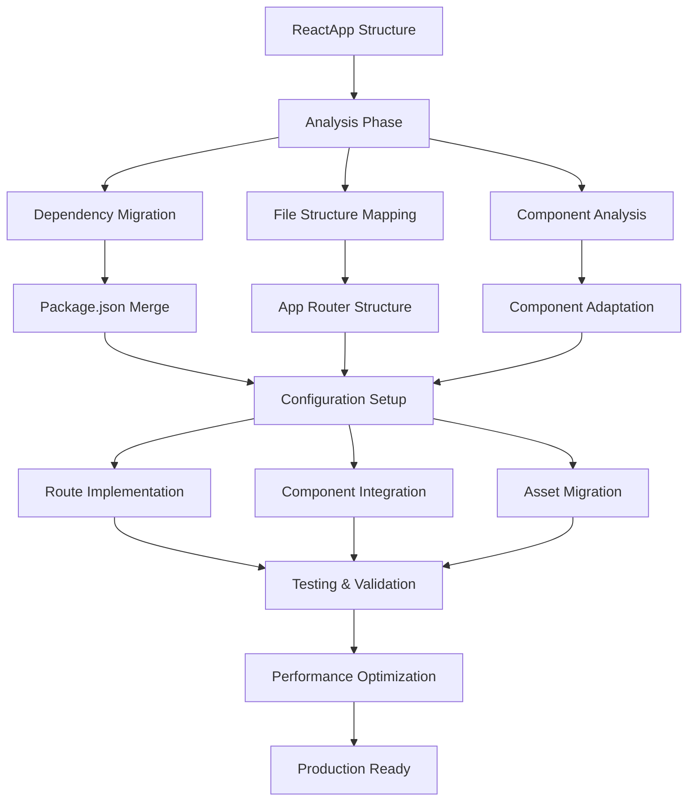

# Design Document

## Overview

This design document outlines the comprehensive migration strategy for converting a React application built with Vite, React Router, and TypeScript to a Next.js 15 application using the App Router. The migration will preserve all existing functionality while leveraging Next.js features for improved performance, SEO, and developer experience.

The ReactApp is a marketing agency website with complex routing, multiple page types, rich media content, and sophisticated styling. The migration strategy focuses on maintaining visual and functional parity while adapting to Next.js conventions.

## Architecture

### Current Architecture (ReactApp)
- **Build Tool**: Vite with React plugin
- **Routing**: React Router DOM with BrowserRouter
- **State Management**: TanStack Query (React Query) for server state
- **Styling**: Tailwind CSS with custom configuration and SCSS
- **TypeScript**: Full TypeScript implementation
- **Layout**: BaseLayout with Navbar/Footer wrapper
- **Assets**: Public directory with images, documents, videos

### Target Architecture (Next.js)
- **Framework**: Next.js 15 with App Router
- **Routing**: File-based routing with dynamic segments
- **State Management**: TanStack Query with Next.js integration
- **Styling**: Tailwind CSS with Next.js optimization
- **TypeScript**: Next.js TypeScript configuration
- **Layout**: Root layout with nested layouts
- **Assets**: Next.js public directory with Image optimization

### Migration Strategy



## Components and Interfaces

### File Structure Mapping

#### Current ReactApp Structure → Next.js Structure

```
ReactApp/src/
├── components/          → src/components/
│   ├── Home/           → src/components/Home/
│   ├── Portfolio/      → src/components/Portfolio/
│   ├── Blog/           → src/components/Blog/
│   ├── Services/       → src/components/Services/
│   ├── Report/         → src/components/Report/
│   ├── common/         → src/components/common/
│   ├── layout/         → src/components/layout/
│   └── ui/             → src/components/ui/
├── pages/              → src/app/
│   ├── HomePage.tsx    → src/app/page.tsx
│   ├── Services/       → src/app/services/
│   ├── Portfolio/      → src/app/portfolio/
│   ├── Blog/           → src/app/blog/
│   ├── Report/         → src/app/report/
│   ├── Docs/           → src/app/case-studies/
│   └── Careers.tsx     → src/app/careers/
├── services/           → src/services/
├── types/              → src/types/
├── utils/              → src/utils/
├── lib/                → src/lib/
└── styles/             → src/styles/

ReactApp/public/        → public/
├── images/             → public/images/
├── docs/               → public/docs/
└── ...                 → public/...
```

### Route Mapping

#### React Router → Next.js App Router

| React Router Route | Next.js App Router Path | Component |
|-------------------|------------------------|-----------|
| `/` | `src/app/page.tsx` | HomePage |
| `/services` | `src/app/services/page.tsx` | ServicesPage |
| `/services/:slug` | `src/app/services/[slug]/page.tsx` | SingleServicePage |
| `/portfolio` | `src/app/portfolio/page.tsx` | PortfolioPage |
| `/portfolio/:slug` | `src/app/portfolio/[slug]/page.tsx` | ProjectPage |
| `/blog` | `src/app/blog/page.tsx` | Blog |
| `/blog/:slug` | `src/app/blog/[slug]/page.tsx` | BlogPost |
| `/careers` | `src/app/careers/page.tsx` | Careers |
| `/report` | `src/app/report/page.tsx` | ReportPage |
| `/case-studies` | `src/app/case-studies/page.tsx` | DocsListPage |
| `/case-studies/:slug` | `src/app/case-studies/[slug]/page.tsx` | DocsViewerPage |

### Layout Architecture

#### Root Layout Structure
```typescript
// src/app/layout.tsx
export default function RootLayout({
  children,
}: {
  children: React.ReactNode
}) {
  return (
    <html lang="en">
      <body className={`${geistSans.variable} ${geistMono.variable} antialiased font-archivo text-cultark-gray`}>
        <QueryProvider>
          <Navbar />
          <main>
            {children}
          </main>
          <Footer />
        </QueryProvider>
      </body>
    </html>
  )
}
```

#### Component Adaptation Strategy

1. **Layout Components**
   - Convert `BaseLayout` to Next.js root layout
   - Preserve `Navbar` and `Footer` as client components
   - Maintain scroll-to-top functionality with Next.js navigation

2. **Page Components**
   - Convert page components to Next.js page components
   - Replace React Helmet with Next.js Metadata API
   - Maintain component composition and props

3. **Client Components**
   - Add `'use client'` directive where needed
   - Preserve interactive functionality
   - Maintain state management patterns

## Data Models

### Dependency Migration Matrix

| ReactApp Package | Next.js Equivalent | Migration Strategy |
|------------------|-------------------|-------------------|
| `react-router-dom` | Next.js App Router | Replace with Next.js navigation |
| `react-helmet-async` | Next.js Metadata API | Convert to metadata exports |
| `@tanstack/react-query` | Keep with Next.js setup | Configure for SSR compatibility |
| `vite` | Next.js build system | Remove, use Next.js bundling |
| `tailwindcss` | Keep with Next.js config | Merge configurations |
| `axios` | Keep | No changes needed |
| `react-icons` | Keep | No changes needed |
| `embla-carousel-react` | Keep | No changes needed |
| `@radix-ui/*` | Keep | No changes needed |

### Configuration Files Migration

#### Tailwind Configuration
```javascript
// tailwind.config.js (merged)
module.exports = {
  content: [
    './src/pages/**/*.{js,ts,jsx,tsx,mdx}',
    './src/components/**/*.{js,ts,jsx,tsx,mdx}',
    './src/app/**/*.{js,ts,jsx,tsx,mdx}',
  ],
  theme: {
    extend: {
      // Preserve all ReactApp custom theme configuration
      colors: {
        cultark: {
          green: '#A5F269',
          blue: '#0F19D3',
          orange: '#ED7837',
          gray: '#2B2B2B',
          white: '#F4F4F4',
          'light-gray': '#DDDDDD',
          'faded-white': '#F9F9F99E'
        },
        // ... rest of colors
      },
      fontFamily: {
        archivo: ['Archivo', 'sans-serif'],
        manrope: ['Manrope', 'sans-serif']
      },
      // ... rest of theme extensions
    },
  },
  plugins: [
    // Preserve all existing plugins
    require('fluid-tailwind'),
    require('tailwindcss-animate'),
    // Custom utility plugins
  ],
}
```

#### TypeScript Configuration
```json
// tsconfig.json (merged)
{
  "compilerOptions": {
    "target": "ES2017",
    "lib": ["dom", "dom.iterable", "esnext"],
    "allowJs": true,
    "skipLibCheck": true,
    "strict": true,
    "noEmit": true,
    "esModuleInterop": true,
    "module": "esnext",
    "moduleResolution": "bundler",
    "resolveJsonModule": true,
    "isolatedModules": true,
    "jsx": "preserve",
    "incremental": true,
    "plugins": [
      {
        "name": "next"
      }
    ],
    "paths": {
      "@/*": ["./src/*"]
    }
  },
  "include": ["next-env.d.ts", "**/*.ts", "**/*.tsx", ".next/types/**/*.ts"],
  "exclude": ["node_modules"]
}
```

## Error Handling

### Migration Error Scenarios

1. **Routing Conflicts**
   - **Issue**: React Router patterns not compatible with Next.js
   - **Solution**: Map each route individually, handle dynamic segments
   - **Fallback**: Create custom route handlers for complex patterns

2. **Client-Side Dependencies**
   - **Issue**: Components using browser-only APIs
   - **Solution**: Add `'use client'` directive and conditional rendering
   - **Fallback**: Use dynamic imports with `ssr: false`

3. **Asset Path Issues**
   - **Issue**: Asset paths breaking after migration
   - **Solution**: Update all asset references to use Next.js public directory
   - **Fallback**: Create asset mapping utility

4. **SEO Metadata**
   - **Issue**: React Helmet not working in Next.js
   - **Solution**: Convert to Next.js Metadata API
   - **Fallback**: Use next/head for complex cases

### Error Boundaries
```typescript
// src/components/ErrorBoundary.tsx (preserve existing)
// Ensure compatibility with Next.js error handling
```

## Testing Strategy

### Migration Validation Approach

1. **Visual Regression Testing**
   - Compare screenshots of each page before/after migration
   - Validate responsive design across breakpoints
   - Check component interactions and animations

2. **Functional Testing**
   - Test all navigation paths
   - Verify form submissions and API calls
   - Validate dynamic content loading

3. **Performance Testing**
   - Compare Core Web Vitals metrics
   - Test page load times
   - Validate image optimization

4. **SEO Testing**
   - Verify meta tags and structured data
   - Test social media sharing
   - Check search engine indexing

### Testing Checklist

- [ ] All routes accessible and functional
- [ ] Navigation between pages works correctly
- [ ] Dynamic routes (services/[slug], blog/[slug], etc.) work
- [ ] Forms submit correctly
- [ ] API calls function properly
- [ ] Images and media load correctly
- [ ] Responsive design maintained
- [ ] SEO metadata present and correct
- [ ] Performance metrics meet or exceed original
- [ ] Error pages display correctly

## Implementation Phases

### Phase 1: Foundation Setup
1. Create Next.js project structure
2. Migrate and merge configuration files
3. Set up Tailwind CSS with custom configuration
4. Configure TypeScript with proper paths

### Phase 2: Core Migration
1. Migrate layout components (Navbar, Footer, BaseLayout)
2. Create root layout with providers
3. Migrate utility functions and services
4. Set up error boundaries and loading states

### Phase 3: Page Migration
1. Migrate home page and core components
2. Set up dynamic routing for services, blog, portfolio
3. Migrate static pages (careers, report, case-studies)
4. Implement 404 and error pages

### Phase 4: Asset and Content Migration
1. Move all static assets to public directory
2. Update asset references throughout codebase
3. Optimize images with Next.js Image component
4. Migrate PDF and document handling

### Phase 5: Integration and Testing
1. Set up TanStack Query with Next.js
2. Test all API integrations
3. Validate SEO metadata and social sharing
4. Performance optimization and testing

### Phase 6: Production Readiness
1. Configure build and deployment settings
2. Set up environment variables
3. Final testing and validation
4. Documentation and handover

## Performance Considerations

### Next.js Optimizations to Leverage

1. **Automatic Code Splitting**
   - Pages automatically split into separate bundles
   - Improved initial page load times

2. **Image Optimization**
   - Replace `` tags with Next.js `<Image>` component
   - Automatic WebP conversion and lazy loading

3. **Font Optimization**
   - Use Next.js font optimization for Google Fonts
   - Reduce layout shift and improve loading

4. **Static Generation**
   - Consider SSG for static content like case studies
   - Improve SEO and performance for static pages

5. **Bundle Analysis**
   - Use Next.js bundle analyzer to identify optimization opportunities
   - Remove unused dependencies from ReactApp

### Migration-Specific Optimizations

1. **Component Lazy Loading**
   - Implement dynamic imports for heavy components
   - Reduce initial bundle size

2. **Asset Optimization**
   - Compress images and videos
   - Use appropriate formats (WebP, AVIF)

3. **CSS Optimization**
   - Purge unused Tailwind classes
   - Optimize custom CSS and animations

## Security Considerations

1. **Environment Variables**
   - Migrate environment variables to Next.js format
   - Ensure proper client/server variable separation

2. **API Security**
   - Review and secure API endpoints
   - Implement proper CORS and security headers

3. **Content Security Policy**
   - Configure CSP headers for enhanced security
   - Handle inline styles and scripts properly

## Deployment Strategy

### Vercel Deployment (Recommended)
- Automatic deployments from Git
- Edge functions for API routes
- Built-in performance monitoring

### Alternative Deployment Options
- Docker containerization
- Traditional hosting with Node.js
- Static export for CDN deployment

## Rollback Plan

1. **Version Control**
   - Maintain ReactApp in separate branch
   - Tag stable versions for easy rollback

2. **Gradual Migration**
   - Deploy to staging environment first
   - A/B test critical user flows

3. **Monitoring**
   - Set up error tracking and performance monitoring
   - Monitor user feedback and analytics

## Success Metrics

1. **Performance Metrics**
   - Core Web Vitals improvement
   - Page load time reduction
   - Bundle size optimization

2. **SEO Metrics**
   - Search engine ranking maintenance
   - Social sharing functionality
   - Meta tag completeness

3. **User Experience Metrics**
   - Navigation flow completion
   - Form submission success rates
   - Error rate reduction

4. **Developer Experience Metrics**
   - Build time improvement
   - Development server startup time
   - Hot reload performance